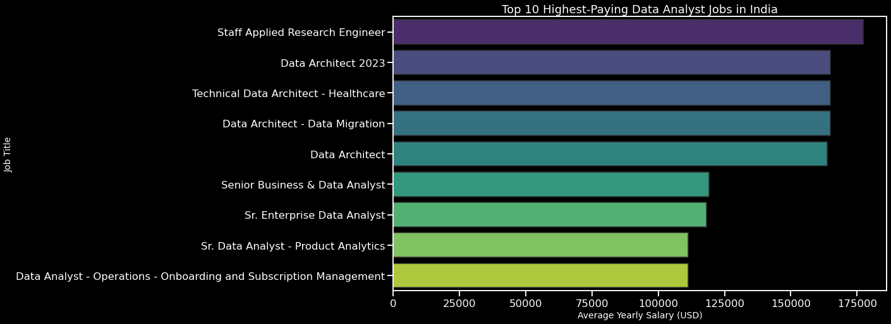
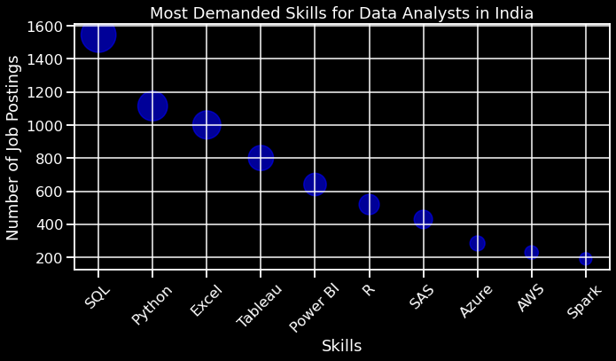
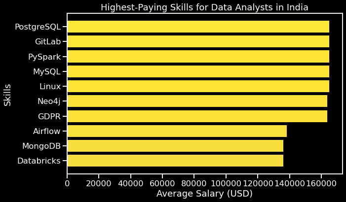
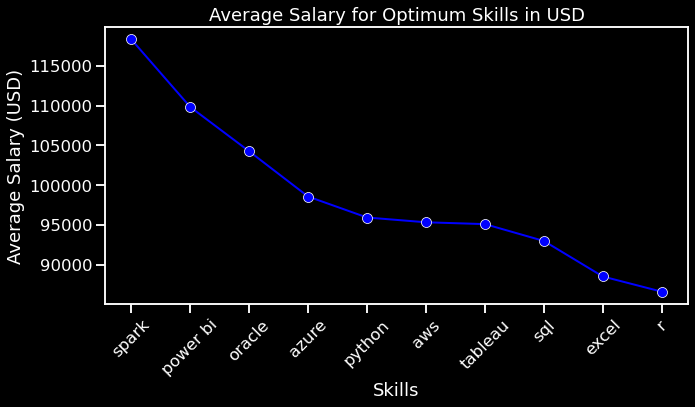

# Intoduction
This project aims to identify the key skills required for Data Analysts in India by analyzing job postings. Using SQL for data extraction and Python for visualization, we determine which skills are most demanded and offer the highest salaries, providing valuable insights for aspiring Data Analysts.

The SQL queries I used are: [project_sql](/project_sql/)
# Background
In the rapidly evolving field of data science, the role of a Data Analyst has become increasingly vital for organizations. With the growing demand for data-driven decision-making, it's crucial to understand the skills that are most valued in the industry. This project aims to provide a clear picture of the optimum skills required for Data Analysts in India, helping professionals align their competencies with market demands. By analyzing job postings, we can identify the most sought-after and highest-paying skills, offering guidance for career development in this competitive field

Data hails from my:[SQL Project](https://www.lukebarousse.com/sql)

### The questions I wanted to answer through my SQL Queries were:
1.What are the highest-paying Data Analyst jobs in India?

2.What skills are associated with the top-paying Data Analyst jobs?

3.What are the most demanded skills for Data Analysts in the Indian job market?

4.What are the highest-paying skills for Data Analysts in India?

5.What are the optimum skills required for Data Analysts in India based on both demand and salary?

# Tools I Used
This project leverages various tools to analyze and visualize the optimum skills for Data Analysts in India, ensuring efficient data handling, version control, and collaboration.

 - **PostgreSQL**: Used for storing and querying job postings data.
 - **Git**: Employed for version control to track changes in the project.
 - **GitHub**: Platform for hosting and sharing the project, enabling collaboration.
 - **Python**: Utilized for data analysis and visualization with libraries such as pandas, matplotlib, and seaborn.
# The Analysis
### Question 1: What are the highest-paying Data Analyst jobs in India?

To identify the highest-paying Data Analyst jobs in India, we queried the job postings database to extract relevant job titles, locations, average yearly salaries, posting dates, and company names. By focusing on the top 10 highest-paying positions, we can gain insights into where and with which companies these lucrative roles are available.
``` sql
SELECT
    job_id,
    job_title,
    job_location,
    job_schedule_type,
    salary_year_avg,
    job_posted_date,name as comapny_name
FROM job_postings_fact
LEFT JOIN company_dim on company_dim.company_id=job_postings_fact.company_id
WHERE job_title_short='Data Analyst' AND
    job_location LIKE'%India' AND salary_year_avg IS NOT NULL
ORDER BY salary_year_avg DESC
LIMIT 10;
```
Here's the breakdown of the inferences from the output of this query:
 - **Job Titles:** The query includes not only "Data Analyst" roles but also related positions such as "Staff Applied Research Engineer" and "Data Architect."
 - **Locations:** High-paying roles are primarily located in major cities like Hyderabad, Bengaluru, and Gurugram.
 - **Companies:** Well-known companies such as ServiceNow, Bosch Group, and Deutsche Bank appear in the list, indicating that these organizations offer competitive salaries.
 - **Salary Range:** The highest salary listed is USD 177,283, and the lowest in the top 10 is USD 111,175, showing a significant range within high-paying positions.


 *Bar graph visualizing the top 10 salaries for the data analyst role.*


### Query 2: Top Paying Job Skills

The second query aims to identify the top paying job skills required for Data Analyst positions in India. By analyzing salary averages across various skills associated with Data Analyst roles, we can discern which skills are most financially rewarding in the job market.

``` sql
WITH top_paying_job AS(
SELECT
    job_id,
    job_title,
    job_location,
    job_schedule_type,
    salary_year_avg,
    job_posted_date,name as comapny_name
FROM job_postings_fact
LEFT JOIN company_dim on company_dim.company_id=job_postings_fact.company_id
WHERE job_title_short='Data Analyst' AND
    job_location LIKE'%India' AND salary_year_avg IS NOT NULL
ORDER BY salary_year_avg DESC

)

SELECT top_paying_job.*, skills
FROM top_paying_job
INNER JOIN skills_job_dim ON skills_job_dim.job_id=top_paying_job.job_id
INNER JOIN skills_dim ON skills_dim.skill_id=skills_job_dim.skill_id
ORDER BY salary_year_avg DESC
```
From the output of the query:

- PostgreSQL, GitLab, PySpark, MySQL, and Linux are among the top paying skills, each commanding an average salary of $165,000 USD annually.
- Skills like Neo4j, GDPR, Airflow, MongoDB, and Databricks also show high earning potential, with average salaries ranging from $138,087.5 to $135,994 USD annually.

### Question 3: What are the most demanded skills for Data Analysts in the Indian job market?

This query aims to identify the skills that are most in demand for Data Analyst roles across India. By analyzing job postings, we can understand which skills employers frequently seek in prospective candidates.

``` sql
SELECT count(job_postings_fact.job_id) as company_demanded,
       skills
FROM job_postings_fact
INNER JOIN skills_job_dim ON skills_job_dim.job_id=job_postings_fact.job_id
INNER JOIN skills_dim on skills_dim.skill_id=skills_job_dim.skill_id
WHERE job_title_short='Data Analyst' AND 
      job_location LIKE '% India'
GROUP BY skills
ORDER BY company_demanded DESC
LIMIT 10;
```
These are the inferences from Output:
- **SQL:** SQL tops the list as the most demanded skill, reflecting its fundamental role in data manipulation and querying.
- **Python:** Python follows closely behind SQL, highlighting its importance in data analysis and scripting.
- **Excel:** Excel remains highly relevant, emphasizing its role in data management and analysis.
- **Visualization Tools:** Tools like Tableau and Power BI are also significant, indicating the need for skills in data visualization.
- **Cloud Technologies:** Azure and AWS are increasingly essential, showcasing the industry's shift towards cloud-based data solutions.


*This scatter plot visualizes the most demanded skills for Data Analysts in India, where each point represents a skill. The size of each point corresponds to the number of job postings mentioning that skill, providing a clear visual representation of demand across different skills.*

### Question 4: What are the highest-paying skills for Data Analysts in India?
In this analysis, we aimed to identify the skills associated with the highest average salaries for Data Analyst roles in India. The query extracted data from job postings and calculated the average yearly salary for each skill. The findings provide insights into which skills command the highest financial rewards in the Indian job market for Data Analysts.

``` sql
SELECT
    round(avg(salary_year_avg),2) as average_salary,skills
from job_postings_fact
INNER JOIN skills_job_dim on skills_job_dim.job_id=job_postings_fact.job_id
INNER JOIN skills_dim on skills_dim.skill_id=skills_job_dim.skill_id
WHERE job_title_short='Data Analyst' 
    AND job_location LIKE '%India' AND
    salary_year_avg IS NOT NULL
GROUP BY skills
ORDER BY average_salary DESC
LIMIT 10
```
Inferences from the Output:
- PostgreSQL, GitLab, PySpark, MySQL, and Linux are the top skills associated with the highest average salaries, all earning USD 165,000 annually.
- Skills like Neo4j and GDPR also offer competitive average salaries of USD 163,782.
- Airflow, MongoDB, and Databricks round out the top 10 highest-paying skills, with salaries ranging from USD 135,994 to USD 138,087.5. 


*This horizontal bar chart visually represents the average yearly salaries associated with each skill identified from the analysis*

### Question 5: What are the optimum skills required for Data Analysts in India based on both demand and salary?

This analysis aims to determine the optimal skills essential for Data Analyst roles in India by considering both job demand and average salary (calculated in USD). The findings will help aspiring Data Analysts prioritize their skill development based on market trends and earning potential.

``` sql
WITH salary_avg AS(
SELECT
    round(avg(salary_year_avg),2) as average_salary,skills,
    skills_dim.skill_id
from job_postings_fact
INNER JOIN skills_job_dim on skills_job_dim.job_id=job_postings_fact.job_id
INNER JOIN skills_dim on skills_dim.skill_id=skills_job_dim.skill_id
WHERE job_title_short='Data Analyst' 
    AND job_work_from_home = TRUE AND
    salary_year_avg IS NOT NULL
GROUP BY skills_dim.skill_id),
 demand AS(
SELECT count(job_postings_fact.job_id) as company_demanded,
       skills, skills_dim.skill_id
FROM job_postings_fact
INNER JOIN skills_job_dim ON skills_job_dim.job_id=job_postings_fact.job_id
INNER JOIN skills_dim on skills_dim.skill_id=skills_job_dim.skill_id
WHERE job_title_short='Data Analyst' AND 
      job_work_from_home = TRUE AND
          salary_year_avg IS NOT NULL

GROUP BY skills_dim.skill_id
)

select salary_avg.skills,
    salary_avg.skill_id,
    company_demanded,
    average_salary
from salary_avg
INNER JOIN demand ON demand.skill_id=salary_avg.skill_id
WHERE company_demanded>10
oRDER BY average_salary DESC,
    company_demanded DESC
         
LIMIT 25;


-- or we can write all the query in the below given code

SELECT
     skills_dim.skill_id,
     skills_dim.skills,
     count(job_postings_fact.job_id) as job_count,
     round(avg(job_postings_fact.salary_year_avg),2) as sala_avg
FROM job_postings_fact
INNER JOIN skills_job_dim ON skills_job_dim.job_id=job_postings_fact.job_id
INNER JOIN skills_dim on skills_dim.skill_id=skills_job_dim.skill_id
WHERE job_title_short like 'Data Analyst' AND 
      job_location like '%India' AND
          salary_year_avg IS NOT NULL 
GROUP BY skills_dim.skill_id
HAVING count(job_postings_fact.job_id) >10
oRDER BY sala_avg DESC,
    job_count DESC
         
LIMIT 25;

```
Inferences from Output:
- Skills like SQL, Python, and Excel are highly demanded and offer competitive salaries.
- Technical skills such as Tableau, Power BI, and R are also in demand but may vary slightly in average salary.
- Skills related to cloud platforms like Azure and AWS are increasingly valuable in the market.
- Specialized skills such as Spark and PostgreSQL command high salaries but have lower demand compared to more generalized skills.

The table shows the job count and average salary associated with the optimum skills for Data Analysts in India, helping professionals prioritize skill development based on market demand and earning potential.
|Skills  |	Job Count|	Salary Avg
|--------|-----------|-------------
|spark   | 11	     |118,332.45
|power bi| 	17	     |109,832.18|
|oracle  |	11	     | 104,260.32
|azure	 |15	     | 98,569.80
|python	 |36	     | 95,933.33
|aws	 |12	     | 95,333.00
|tableau | 20	     | 95,102.80
|sql	 | 46	     | 92,983.62
|excel	 | 39	     | 88,518.96
|r	     | 18	     | 86,609.11



*This is a line plot with markers. It visualizes the average salary for each of the identified optimum skills for Data Analysts in India, providing a clear comparison across different skills.*
# What I Learned 
- **SQL and PostgreSQL Skills:** Through this project, I enhanced my proficiency in SQL and PostgreSQL for data extraction, manipulation, and analysis. I learned to write complex queries to retrieve specific information from databases, such as identifying top-paying job positions and analyzing skill demand in the job market.

- **Git Version Control:** Utilizing Git for version control allowed me to track changes, collaborate effectively, and maintain a structured approach to project development. I learned to manage branches, merge changes, and ensure project integrity across different stages of development.

- **Data Analysis and Visualization with Python:** Employing Python, along with libraries like pandas, matplotlib, and seaborn, I gained insights into visualizing complex data sets. This project enabled me to create meaningful visualizations that highlight trends and patterns in job postings data, facilitating informed decision-making for career planning in the field of Data Analysis.
# Conclusion
In conclusion, this project aimed to identify the optimum skills required for Data Analysts in India by analyzing job postings data using SQL for data extraction and PostgreSQL for database management. Through the use of Python for data analysis and visualization, insights were derived to guide aspiring Data Analysts in skill development and career planning.

Key Insights:
- **Skill Prioritization:** The analysis highlighted skills such as SQL, Python, and Excel as crucial for Data Analyst roles in India, owing to their high demand and competitive salaries. These skills should be prioritized by professionals aiming to excel in the field.

- **Emerging Technologies:** Skills related to cloud platforms like Azure and AWS, along with data visualization tools such as Tableau and Power BI, are increasingly valuable. Professionals should consider acquiring these skills to stay relevant in a rapidly evolving technological landscape.

- **Salary Trends:** Specialized skills like Spark and PostgreSQL command high salaries but may have lower demand compared to more generalized skills. This underscores the importance of balancing specialization with skills that have broad applicability across industries.

This project not only provided valuable insights into the current landscape of Data Analyst roles in India but also equipped me with practical experience in SQL, PostgreSQL, Git version control, and data visualization techniques, enhancing my capabilities for future data-driven endeavors.